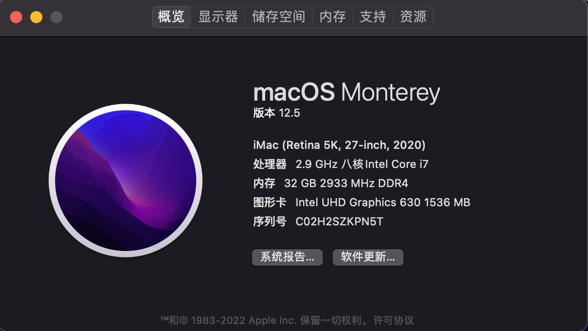

# Asrock Deskmini H470W Hackintosh

## 硬件

- CPU：Intel i7-10700
- RAM：Samsung DDR4 SO-DIMM 2933Mhz 16Gb x2
- SSD：Kingston KC2500 1TB
- WiFi：BCM94360CS2
- Cooling：Thermalright AXP90-X47

## 软件

| Name             | Version             |
| ---------------- | ------------------- |
| OS               | macOS Monterey 12.5 |
| OpenCore         | 0.8.3               |
| AirportBrcmFixup | 2.1.6               |
| AppleALC         | 1.7.4               |
| BrcmPatchRAM     | 2.6.3               |
| FeatureUnlock    | 1.0.9               |
| IntelMausi       | 1.0.7               |
| Lilu             | 1.6.2               |
| NVMeFix          | 1.1.0               |
| VirtualSMC       | 1.3.0               |
| WhateverGreen    | 1.6.1               |

## 使用指南

### 准备工作

- 制作启动 U 盘：参考文档：[Creating the USB](https://dortania.github.io/OpenCore-Install-Guide/installer-guide/)

- 编辑 plist 工具：[ProperTree](https://github.com/corpnewt/ProperTree)
- 序列号生成：[GenSMBIOS](https://github.com/corpnewt/GenSMBIOS)

> 注意：Windows 使用 Rufus 制作 U 盘，需要使用快捷键 `Alt + L`开启 Large FAT32

### 替换 EFI

制作完 U 盘后，将 EFI 目录放入 U 盘中。

U 盘结构应该如下：

打开 GenSMBIOS（Mac 运行 command 文件，windows 运行 bat 文件），先输入 1，再输入 3。根据不同 CPU 型号输入不同型号可得到序列号：

| SMBIOS   | Hardware                              |
| -------- | ------------------------------------- |
| iMac20,1 | i7-10700K 及以下 CPU（小于等于 8 核） |
| iMac20,2 | i9-10850K 及以上 CPU（10 核）         |

得到序列号后，使用 ProperTree 打开 `/EFI/OC` 目录下的 config.plist 文件。将得到的序列号填入 PlatformInfo -> Generic 下的对应字段：

| Parameter    | Value              |
| ------------ | ------------------ |
| Type         | SystemProductName  |
| Serial       | SystemSerialNumber |
| Board Serial | MLB                |
| SmUUID       | SystemUUID         |
| Apple ROM    | ROM                |

输入完信息后保存 config.plist 文件。

## BIOS 设置

### Disable

- Fast Boot
- Secure Boot
- Intel  Platform Trust

## 已知问题

- HDMI 最高只支持 3840x2160@30fps 输出。尽量用 dp 信号。
- 接双屏情况下，需要先使用一个显示器开机，进入系统后再接第二个显示器。

